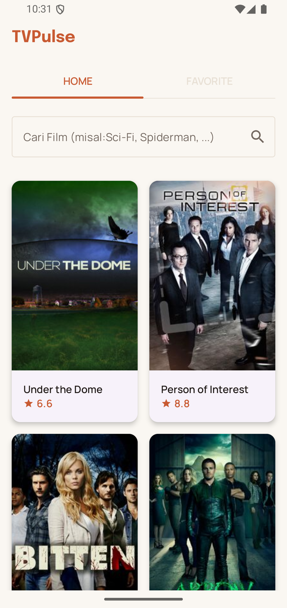
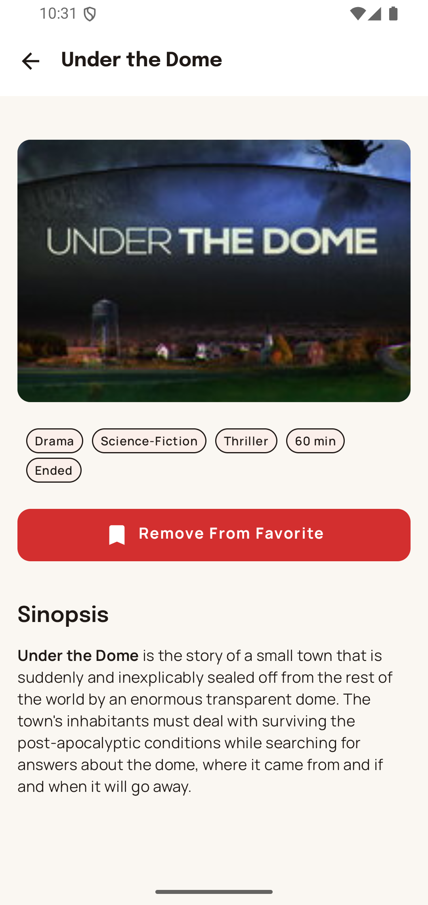
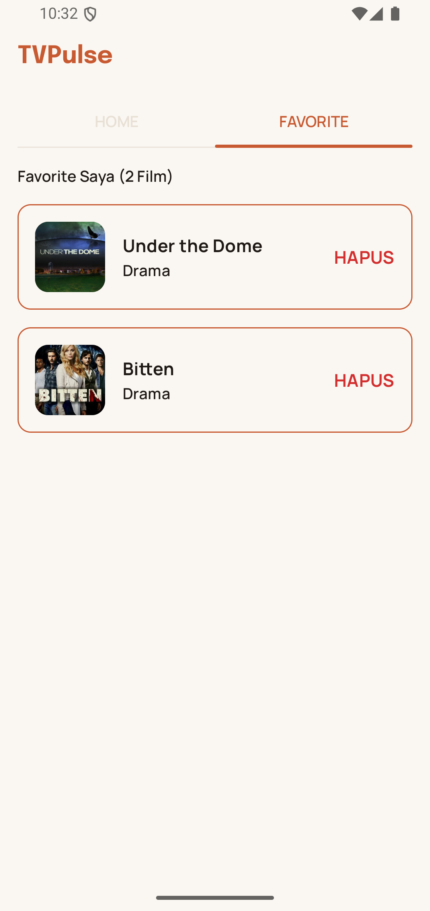
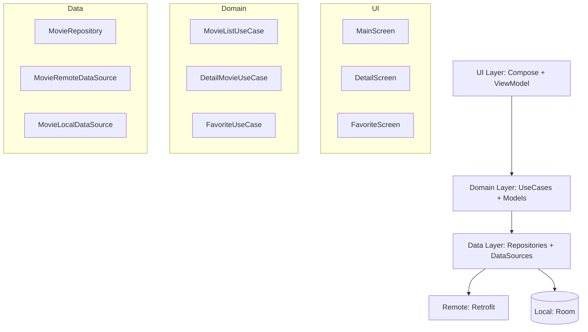
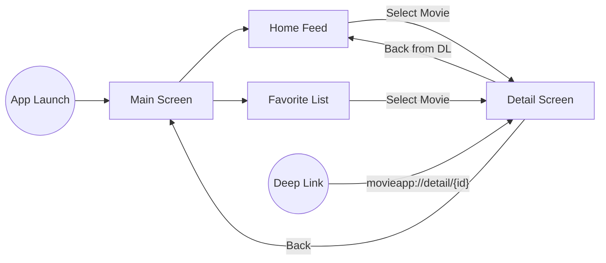

# TVPulse


[](https://github.com/henrasn/TVPulse/releases/latest)

TVPulse is a modern Android application for discovering and managing your favorite TV shows. Built
with modern Android development practices, it provides a seamless experience for browsing popular
content and keeping track of shows you love.

|              Home Screen              |                 Movie Detail                  |               Favorite List               |
|:-------------------------------------:|:---------------------------------------------:|:-----------------------------------------:|
|  |  |  |

## 🛠 Getting Started

### Requirements

- **JDK**: 17
- **Android SDK**: 36 (Android 16 / Baklava)
- **Android Studio**: Latest Preview (required for SDK 36 support)

## 🚀 Tech Stack

- **UI**: [Jetpack Compose](https://developer.android.com/compose) (Material 3)
- **Dependency Injection**: [Hilt](https://dagger.dev/hilt/) (with KSP)
- **Networking**: [Retrofit 3](https://square.github.io/retrofit/) & OkHttp 5
- **Serialization**: [Kotlinx Serialization](https://kotlinlang.org/docs/serialization.html)
- **Local Database**: [Room 2.8.5](https://developer.android.com/training/data-storage/room)
- **Image Loading**: [Coil 3](https://coil-kt.github.io/coil/)
- **Navigation**: [Navigation 3](https://developer.android.com/guide/navigation/navigation-3)
- **Animations**: Compose Shimmer for skeleton screens.

## 🏗 Architecture

The project follows **Clean Architecture** principles combined with **MVVM (Model-View-ViewModel)**.

### Layer Dependency Graph



## 🗺 Navigation Flow

The app uses Navigation 3 for a robust, type-safe navigation system supporting deep links and state
restoration.



## 📂 Project Structure

```text
TVPulse/
├── build.gradle.kts                  # root: plugins only
├── settings.gradle.kts               # repo management, module :app
├── gradle/libs.versions.toml         # all dependency versions
└── app/
    ├── build.gradle.kts
    └── src/
        ├── main/java/com/henrasn/tvpulse/
        │   ├── core/
        │   │   ├── app/              # @HiltAndroidApp Application
        │   │   ├── di/               # @IoDispatcher / @MainDispatcher + module
        │   │   ├── error/            # AppException, ErrorUiText, Throwable.toUiText()
        │   │   └── network/          # Retrofit layer, interceptors, safeApiCall
        │   ├── data/
        │   │   ├── model/            # DTOs and Room Entities
        │   │   ├── module/           # Hilt @Binds / @Provides modules
        │   │   ├── repository/       # Repository interface + Impl
        │   │   └── source/           # Remote & Local DataSources
        │   ├── domain/
        │   │   ├── mapper/           # DTO -> UI model mappers
        │   │   ├── model/            # UI data models
        │   │   └── usecase/          # Business logic UseCases
        │   └── ui/
        │       ├── component/        # reusable composables (MovieCard, ImageUrl...)
        │       ├── navigation/       # Nav3 NavDisplay / entryProvider wiring
        │       ├── pages/<feature>/  # Screen + ViewModel + UiState
        │       └── theme/            # Color.kt, Type.kt, Theme.kt
        ├── res/                      # drawable, mipmap, values, xml
        ├── test/                     # local JVM unit tests
        └── androidTest/              # instrumented Compose UI tests
```

## 🔗 Deep Link Test

You can trigger the movie detail screen directly using ADB:

```bash
adb shell am start -W -a android.intent.action.VIEW -d "movieapp://detail/123" com.henrasn.tvpulse
```

## 🎨 Design & Assets

Detailed designs and requirement documents can be found in
the [docs/](file:///Users/henra/Project/Android/TVPulse/docs/) directory.

- [Requirement.md](file:///Users/henra/Project/Android/TVPulse/docs/Requirement.md)
- [Design.png](file:///Users/henra/Project/Android/TVPulse/docs/Design.png)
